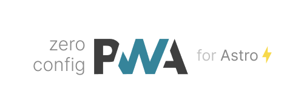

<p align='center'>
<br>
Zero-config PWA Integration for Astro
</p>

<p align='center'>
<a href='https://www.npmjs.com/package/@vite-pwa/astro' target="__blank">

</a>
<a href="https://www.npmjs.com/package/@vite-pwa/astro" target="__blank">
    
</a>
<a href="https://vite-pwa-org.netlify.app/frameworks/astro" target="__blank">
    
</a>
<br>
<a href="https://github.com/vite-pwa/astro" target="__blank">

</a>
</p>

<br>

<p align="center">
  <a href="https://cdn.jsdelivr.net/gh/antfu/static/sponsors.svg">
    
  </a>
</p>


## 🚀 Features

- 📖 [**Documentation & guides**](https://vite-pwa-org.netlify.app/)
- 👌 **Zero-Config**: sensible built-in default configs for common use cases
- 🔩 **Extensible**: expose the full ability to customize the behavior of the plugin
- 🦾 **Type Strong**: written in [TypeScript](https://www.typescriptlang.org/)
- 🔌 **Offline Support**: generate service worker with offline support (via Workbox)
- ⚡ **Fully tree shakable**: auto inject Web App Manifest
- 💬 **Prompt for new content**: built-in support for Vanilla JavaScript, Vue 3, React, Svelte, SolidJS and Preact
- ⚙️ **Stale-while-revalidate**: automatic reload when new content is available
- ✨ **Static assets handling**: configure static assets for offline support
- 🐞 **Development Support**: debug your custom service worker logic as you develop your application

## 📦 Install

> Requires Vite 3.1.0+

```bash
npm i @vite-pwa/astro -D 

# yarn 
yarn add @vite-pwa/astro -D

# pnpm 
pnpm add @vite-pwa/astro -D
```

## 🦄 Usage

Add `@vite-pwa/astro` integration to `astro.config.mjs` and configure it:

```ts
// astro.config.mjs
import { defineConfig } from 'astro/config'
import AstroPWA from '@vite-pwa/astro'

// https://astro.build/config
export default defineConfig({
  integrations: [AstroPWA()]
})
```
Read the [📖 documentation](https://vite-pwa-org.netlify.app/frameworks/astro) for a complete guide on how to configure and use
this plugin.

## 👀 Full config

Check out the following links for more details:

- [Web app manifests](https://developer.mozilla.org/en-US/docs/Web/Manifest)
- [Workbox](https://developers.google.com/web/tools/workbox)


## 📄 License

MIT License © 2022-PRESENT [Anthony Fu](https://github.com/antfu)
